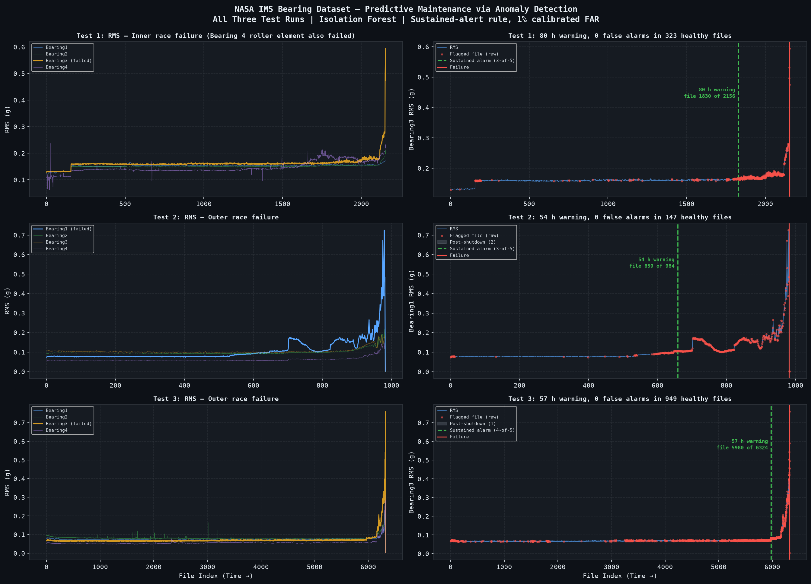

# NASA IMS Bearing Anomaly Detection

Unsupervised detection of rolling-element bearing failure in three run-to-failure test
rigs, 2003–2004 — time-domain vibration features scored by an Isolation Forest.

[](https://github.com/fatemeh-studio/nasa-bearing-anomaly/actions/workflows/ci.yml)
[](https://fatemeh-studio.github.io/nasa-bearing-anomaly/)

**[Read the full analysis →](https://fatemeh-studio.github.io/nasa-bearing-anomaly/)**
The method, the data documentation and all four notebooks rendered with every figure.
**Notebooks in this repo are output-stripped by design**, so github.com shows code, not results.



## Findings

- **54–80 hours of warning before failure, with zero false alarms on held-out healthy
  data** — 79.5 h, 53.7 h and 57.0 h for Tests 1–3, against 0 sustained alarms in
  323 / 147 / 949 healthy files. Upper bounds of fewer than 1 in N, not measured zeros.
  Test 3 is the least stable: tightening the calibrated false-alarm rate from 1% to 0.5%
  moves it from 57 h to 26 h, while Tests 1 and 2 hold within 1 h across that range.
- **The obvious "first alert" metric is meaningless here, measurably so.** All three runs
  flag file 0, because `IsolationForest(contamination=c)` labels that fraction of its own
  *training* window anomalous by construction. Lead time is therefore read from a score
  threshold calibrated on held-out healthy data, never from `is_anomaly`.
- **Test 3 holds 6,324 files, not the 4,448 the official IMS documentation lists.** The
  remainder sits in an undocumented nested folder running to 2004-04-18. At file 4,448
  the bearing is still healthy, so an analysis stopping at the documented cutoff misses
  the failure entirely. RMS peaks at 0.759 on file 6,322 — **11.4× baseline**.
- **The post-shutdown tail is 0, 2 and 1 files for Tests 1–3**, not "the final file of
  each run" as the dataset documentation states. Test 1 ends on its RMS peak, so dropping
  one file there discards the failure itself.

## On the site

- **[Method](https://fatemeh-studio.github.io/nasa-bearing-anomaly/methodology.html)** — features, the counterintuitive directions, rule selection
- **[Data](https://fatemeh-studio.github.io/nasa-bearing-anomaly/data.html)** — source, licence, column dictionary, the Set 3 discrepancy in full
- **[Notebooks 01–04](https://fatemeh-studio.github.io/nasa-bearing-anomaly/notebooks/01_data_exploration.html)** — the analysis, with every figure

## What the warning is worth

Lead time is **not** multiplied by an hourly rate — that prices hours during which the
machine was still running. Warning converts an unplanned stoppage into a planned one, so the
saving is the difference between the two, and only if the warning is long enough to order the
part and book the window. Reported as a sensitivity table over stated assumptions —
[the full model is on the site](https://fatemeh-studio.github.io/nasa-bearing-anomaly/business.html).

## Data

NASA IMS bearing dataset, three run-to-failure tests, 2003-10-22 to 2004-04-18, 20 kHz
accelerometer records. J. Lee et al. (2007), IMS, University of Cincinnati — NASA Ames
Prognostics Data Repository. Raw archive ~6.2 GB, not committed; the summary tables in
`data/processed/` are, so a clean clone runs. Licence, fetch command, column dictionary
and known defects: **[`data/README.md`](data/README.md)**.

## Reproduce

```bash
git clone https://github.com/fatemeh-studio/nasa-bearing-anomaly.git
cd nasa-bearing-anomaly

conda env create -f environment.yml   # or: python -m venv .venv && pip install -e ".[dev,notebook]"
conda activate nasa-bearing-anomaly

pytest                                # 93 tests
jupyter lab notebooks/                # run 01 → 04 in order

# ...or headless, from the committed tables:
python -m nasa_bearing_anomaly.features --test all
python -m nasa_bearing_anomaly.business --test all --feature-source enriched
```

## Repository layout

```
src/nasa_bearing_anomaly/  library code — physics, features, detection, business
notebooks/                 narrative; outputs stripped, figures committed separately
tests/                     93 tests; no __init__.py, so imports resolve as a cloner's do
data/                      raw/ gitignored; processed/ committed. Facts in data/README.md
figures/headline/          only the figure this README embeds
results/                   generated figures and summary tables
```

## Limitations

- **The detector reads time-domain features only.** `features.py` computes defect-frequency
  band energy, spectral entropy and the high-frequency ratio from raw waveforms, and they are
  tested — but the pipeline scores the committed summary tables, so none of them reaches the
  model. Connecting them, and ablating whether they earn their place, is the next step.
- **Lead time is anchored on the end of each run.** The rigs ran to destruction, so the
  last live acquisition is taken as the failure — but no independent ground-truth failure
  timestamp exists to check that against.
- **Zero false alarms is an upper bound, not a rate.** The held-out healthy windows run
  147–949 files; nothing here resolves a rate below roughly 1 in 1,000.
- **Three runs is three samples.** The alert rule is chosen per run against that run's own
  healthy data — correct procedure, but not the same as validating it on an unseen rig.

## Licence

Code MIT (`LICENSE`). Data: see [`data/README.md`](data/README.md).
